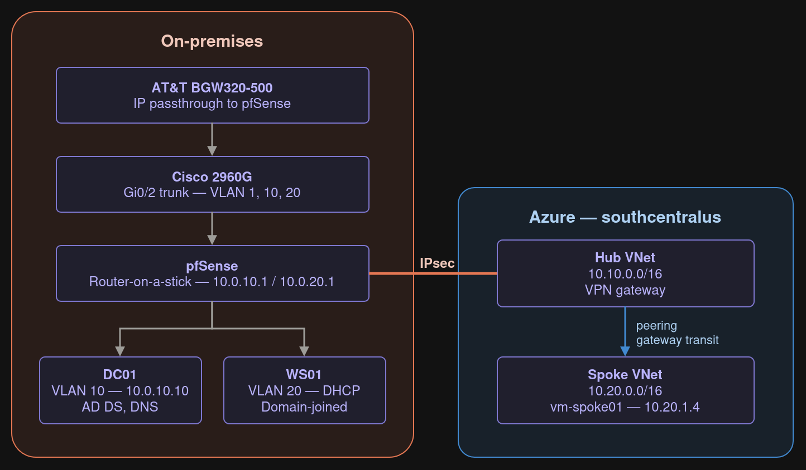

# Hybrid Azure Network Lab

A segmented on-premises network connected to an Azure hub-and-spoke topology over an IPsec site-to-site VPN, with DNS resolving in both directions.

Built on physical switch hardware and KVM virtualization rather than a single hypervisor's virtual networking, so the 802.1Q configuration is real: a Cisco 2960G trunk port carries tagged VLANs to a pfSense router-on-a-stick, which routes between segments and terminates the tunnel to Azure.

---

## Architecture



| Segment | CIDR | Purpose |
|---|---|---|
| On-prem VLAN 10 | 10.0.10.0/24 | Servers (AD DS and DNS) |
| On-prem VLAN 20 | 10.0.20.0/24 | Domain clients |
| **Advertised to Azure** | **10.0.0.0/16** | Summary covering both on-prem segments |
| Azure hub VNet | 10.10.0.0/16 | VPN gateway |
| Hub GatewaySubnet | 10.10.0.0/27 | Name is required verbatim by Azure |
| Azure spoke VNet | 10.20.0.0/16 | Workloads |
| Spoke snet-workload | 10.20.1.0/24 | Test VM and DNS forwarder |

VLAN 1 is the native VLAN on the trunk and carries pfSense's WAN traffic untagged. After IP Passthrough was configured on the ISP gateway, pfSense holds the public address directly on that interface.

`10.0.0.0/16` does not overlap `10.10.0.0/16` or `10.20.0.0/16`, because the second octet differs. Overlapping address space is the most common reason hybrid labs fail, so this was settled before anything was built.

---

## What runs where

**Physical**
- Cisco WS-C2960G-24TC-L, IOS 12.2. VLANs 10 and 20, Gi0/2 configured as an 802.1Q trunk
- AT&T BGW320-500 in IP Passthrough mode, handing the public IP directly to pfSense
- Linux Mint 22.3 host, KVM/libvirt

**Virtual**
- pfSense CE 2.7.2. Single NIC on a trunk bridge, tagging VLANs 10 and 20 internally
- Windows Server 2022. `lab.internal` forest, AD DS, DNS
- Windows 11 Pro. Domain-joined client on VLAN 20

**Azure** (`southcentralus`)
- Hub VNet with a Basic SKU route-based VPN gateway
- Spoke VNet peered with gateway transit
- Ubuntu 24.04 test VM, no public IP
- NSG restricting inbound to the on-prem range
- Route table with an explicit route to on-prem

The same VLAN IDs and tagging behaviour are configured in three places: the switch port, the Linux bridge, and pfSense. All three have to agree.

---

## Verification

| Test | Result |
|---|---|
| Client on VLAN 20 locates the DC on VLAN 10 | `nltest /dsgetdc` returns DC01 at 10.0.10.10 |
| Cross-VLAN connectivity | `ping 10.0.10.10` from 10.0.20.100, 0% loss |
| Hub ↔ spoke peering | Connected and Fully Synchronized both directions |
| IPsec tunnel | Established in pfSense, Connected in Azure |
| On-prem → Azure | `ping 10.20.1.4` from 10.0.10.10, 0% loss, 5–9 ms |
| Azure → on-prem | `ping 10.0.10.10` and `10.0.20.1` from the spoke VM, 0% loss |
| Azure resolves on-prem by name | `dc01.lab.internal` → 10.0.10.10 |
| On-prem resolves Azure by name | `vm-spoke01.internal.cloudapp.net` → 10.20.1.4 |
| Reverse DNS | `nslookup 10.0.10.10` → DC01.lab.internal |
| Effective routes | On-prem prefix Active, next hop VirtualNetworkGateway |

Selected verification evidence is in [`screenshots/`](screenshots/).

---

## Problems hit and how I solved them

### VLAN bridges came up at MTU 1499

NetworkManager subtracted four bytes for the 802.1Q tag when creating the VLAN interfaces. That's wrong. The tag lives in the frame header, not the payload, so the MTU should stay 1500.

Caught before it caused damage, but the failure mode would have been miserable: small packets like ping and DNS pass fine while large frames are silently dropped, so domain join and SMB hang with every obvious test succeeding. Fixed by setting `802-3-ethernet.mtu 1500` explicitly on both VLAN interfaces and their parent bridges.

### IPsec authentication failed with a valid-looking PSK

The tunnel negotiated Phase 1 crypto successfully, then failed with:

```
tried 1 shared key for '%any' - '<AZURE_GW_IP>', but MAC mismatched
generating IKE_AUTH response 1 [ N(AUTH_FAILED) ]
```

Everything else was correct. Proposals matched, both endpoints found each other, and the peer config was selected. The pre-shared key itself was the problem. It had been generated as base64 and moved between a terminal, a password manager, and a VM with no clipboard sharing, and something was lost or added in transit.

Regenerating with `openssl rand -hex 24` removed every character that could be mangled. No `+`, `/`, or `=`, and nothing that looks different in different fonts. The tunnel came up on the next attempt.

### Azure's DNS resolver is unreachable over a VPN

The original plan called for a conditional forwarder on the on-prem DC pointing at Azure's platform resolver at `168.63.129.16`. That address only answers from inside a VNet. Queries arriving over a VPN tunnel time out with no useful error.

The correct enterprise answer is Azure DNS Private Resolver, at roughly $0.27/hr per endpoint. That doesn't fit a lab budget.

Instead, `systemd-resolved` on the spoke VM listens on its private address using `DNSStubListenerExtra` and forwards `internal.cloudapp.net` to `168.63.129.16`. The on-prem DC conditional-forwards that zone to the VM across the tunnel. Same result, no cost.

The package I originally planned to use for this, `dnsmasq`, wasn't installable, because the VM has no public IP and no NAT gateway, so it can't reach the Ubuntu mirrors. `systemd-resolved` turned out to do the job with nothing to install.

### VM SKU capacity restrictions

`Standard_B1s` was unavailable in `southcentralus` due to capacity restrictions. Listing available SKUs showed only Arm64 (Ampere) B-series options in the region, so the deployment moved to `Standard_B2pts_v2` with an arm64 Ubuntu image.

Free-tier eligibility is tied to specific SKUs, so the Arm64 replacement bills where B1s would not have. In practice the VM was deallocated between sessions and the charge was negligible, but it's the kind of substitution that would matter at scale.

### Standard public IP requires explicit zones

Creating the VPN gateway failed with `ZRStandardIpNeeded`. A Standard SKU public IP created without a zone specification isn't zone-redundant, and the gateway requires one that is. Recreating with `--zone 1 2 3` resolved it.

Related: the Basic VPN Gateway SKU can no longer be created through the portal at all. CLI or PowerShell only.

### The peering flag that has to come second

`--use-remote-gateways` on the spoke-to-hub peering fails if the gateway doesn't exist yet, so the peering has to be created first and updated afterward.

Without it, the tunnel establishes and reports Connected while the spoke VNet can't reach on-prem at all. That's the classic "tunnel is up but traffic doesn't pass" symptom, with nothing in the IPsec logs to suggest why.

### pfSense IPsec firewall rules are default-deny

The IPsec interface has its own firewall tab, separate from the VLAN tabs, and it starts empty. Rules permitting the Azure address ranges had to be added explicitly before any traffic crossed the tunnel.

### Two platform settings applied preemptively

Neither of these caused a failure, because both were configured before they could.

**Hardware offload disabled.** virtio NICs under KVM hand FreeBSD frames with checksums the hypervisor fills in later. pfSense reads them as invalid and drops them intermittently, producing random packet loss, stalled TCP sessions, and IPsec tunnels that establish and then pass nothing, all while ping looks fine. Checksum, TSO, and LRO offload were all disabled in System > Advanced > Networking.

**MSS clamped to 1350.** Azure clamps MSS on its side of the tunnel. Without matching, small packets like ping and DNS succeed while anything large (SMB, RDP, file copies) hangs. That symptom pattern is difficult to diagnose because every quick test passes.

### Netgate no longer publishes CE ISOs

pfSense CE downloads now go through a network installer that requires an account and a $0 store checkout. The last standalone offline ISO is 2.7.2, still hosted on Netgate's own mirror. That's a real operational consideration for anyone standardizing on pfSense in an air-gapped or restricted environment.

### libvirt group membership needed a full reboot

Adding the user to `libvirt` and `kvm` wrote to the group database immediately, but a desktop logout wasn't enough for the session to pick it up on Mint 22.3. `virsh` worked anyway via polkit, which masked the problem until it would have surfaced later as confusing permission errors.

### The cost I watched wasn't the cost I was paying

The VPN gateway bills hourly, so it was deleted at the end of every session. After five sessions the actual breakdown was:

| Service | Cost |
|---|---|
| Storage | $0.43 |
| Virtual Network | $0.33 |
| VPN Gateway | $0.05 |
| Virtual Machines | $0.00 |

Azure's cost data lags roughly a day, so the gateway figure trails its actual runtime. Even allowing for that, the ordering held: the resource I was most careful about was the smallest line. The managed disk and the static public IP, both billing continuously regardless of whether anything was running, accounted for the rest. Deallocating a VM stops compute but not storage, and deleting a gateway doesn't touch its public IP.

---

## Design decisions

**Basic SKU VPN gateway over VpnGw2AZ.** Roughly $0.04/hr against $0.25–0.36/hr. The tradeoffs are real: no BGP, no SLA, and no custom IPsec/IKE policy, which means pfSense has to match Azure's default proposals rather than the reverse. Acceptable for a lab; in production the SLA alone would justify the higher tier.

**Route-based over policy-based.** Supports IKEv2 and multiple traffic selectors. Policy-based is IKEv1 and locks the tunnel to a single subnet pair.

**`.internal` over `.local`.** ICANN reserved `.internal` for private use. `.local` conflicts with mDNS/Bonjour and Microsoft advises against it.

**Router-on-a-stick over a second NIC.** The host has one physical Ethernet port. Rather than buying a second, VLANs 10 and 20 ride the existing link as tagged traffic with the native VLAN carrying WAN. Costs nothing and puts the segmentation on the switch where it's visible, rather than hiding it inside the hypervisor.

**IP Passthrough over port forwarding.** AT&T residential gateways handle IPsec forwarding inconsistently. Passthrough hands the public IP directly to pfSense, which also means the IKE identity is a genuine public address rather than a NAT workaround.

**User-defined route.** Gateway transit already propagated the on-prem route, so the UDR isn't strictly required for connectivity. It was added to make routing intent explicit. The effective route table shows the UserDefined entry Active and the gateway-propagated one Invalid, which is a clean demonstration of Azure's route precedence.

**Functional level Windows2016Domain.** The maximum available in Server 2022. Microsoft introduced no new functional levels for 2019 or 2022.

---

## Known limitations

The 2960G runs IOS 12.2, which supports only type 5 (MD5) and type 7 password storage. Type 8 and 9 require 15.x, so the platform cannot store credentials securely by modern standards. Compensating controls applied: VTY access restricted by ACL to the management subnet, SSHv2 only with Telnet disabled, and the HTTP management server turned off. In production this platform would be scheduled for replacement or isolated to an out-of-band management network.

Firewall rules on the VLAN interfaces are permissive. They were kept that way during the build to isolate routing problems from policy problems. Tightening them to least privilege is outstanding work, not something already done.

Basic SKU has no BGP support, so all routing across the tunnel is static. Dynamic routing is a gap this lab does not close.

---

## Repository contents

```
configs/       Sanitized device and cloud configuration
docs/          Build log kept during the build, not reconstructed afterward
screenshots/   Verification evidence
```

`configs/teardown.sh` stops all hourly Azure billing in one command.

Public IPs, pre-shared keys, subscription and tenant IDs, and device serials are redacted throughout. A local pre-commit hook blocks any of them from entering the repository.

---

## Skills demonstrated

802.1Q trunking and VLAN segmentation on Cisco IOS, inter-VLAN routing, pfSense firewall and IPsec configuration, KVM/libvirt bridge networking, Active Directory Domain Services and DNS, Azure hub-and-spoke VNet topology, site-to-site VPN, network security groups, user-defined routes, hybrid DNS design, Azure CLI.
